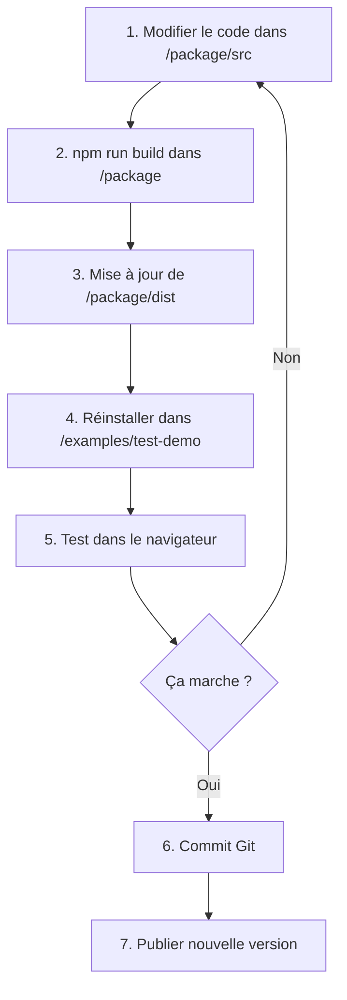

# 🧠 Brain Training - Guide de Développement

## 📋 Table des matières
1. [Architecture du Projet](#architecture-du-projet)
2. [Workflow de Développement](#workflow-de-développement)
3. [Créer un Nouveau Jeu](#créer-un-nouveau-jeu)
4. [Propagation des Changements](#propagation-des-changements)
5. [Bonnes Pratiques](#bonnes-pratiques)
6. [Publication et Versioning](#publication-et-versioning)

---

## 🏗️ Architecture du Projet

### Structure des Dossiers
```
brain-training/
├── package/                      # 📦 Package NPM réutilisable
│   ├── src/
│   │   ├── components/          # Tous les jeux/exercices
│   │   │   ├── MemoryCardGame.tsx
│   │   │   ├── ReactionTime.tsx
│   │   │   └── ...
│   │   ├── themes/              # Système de thèmes
│   │   │   └── index.ts
│   │   ├── types/               # Types TypeScript
│   │   │   └── index.ts
│   │   └── index.ts             # Point d'entrée (exports)
│   ├── dist/                    # Build compilé
│   └── package.json
│
├── examples/                     # 🧪 Démos et tests
│   └── test-demo/               # Demo complète
│       ├── src/
│       │   └── App.tsx
│       └── package.json
│
└── backend/                      # 🔧 API (optionnel)
```

### Concept Clé : Package vs Application

**Package (`/package/`)** :
- C'est une **bibliothèque réutilisable**
- Contient tous les composants/jeux
- Peut être utilisé dans N'IMPORTE QUELLE application React
- Publié sur NPM (ou installé localement)

**Application (`/examples/test-demo/`)** :
- **Consomme** le package
- Juste une vitrine/démo
- Peut être SLF Esport, Shinkofa, ou n'importe quel projet

---

## 🔄 Workflow de Développement

### Cycle de Développement Complet



### Commandes Essentielles

```bash
# 1. DÉVELOPPEMENT DU PACKAGE
cd /home/ubuntu/brain-training/package

# Développer en mode watch (auto-rebuild)
npm run dev

# Build unique
npm run build

# Type-check
npm run type-check


# 2. TEST DANS LA DEMO
cd /home/ubuntu/brain-training/examples/test-demo

# Réinstaller après changement du package
rm -rf node_modules/@theermite
npm install ../../package --legacy-peer-deps --force

# Lancer le serveur de dev
npm run dev


# 3. VERSIONNING & PUBLICATION
cd /home/ubuntu/brain-training/package

# Version patch (1.0.0 -> 1.0.1)
npm version patch

# Version minor (1.0.0 -> 1.1.0)
npm version minor

# Version major (1.0.0 -> 2.0.0)
npm version major

# Publier sur NPM (si configuré)
npm publish
```

---

## 🎮 Créer un Nouveau Jeu

### Étape 1 : Créer le Composant

**Fichier** : `/home/ubuntu/brain-training/package/src/components/MonNouveauJeu.tsx`

```tsx
/**
 * Mon Nouveau Jeu - Description
 * @author Jay "The Ermite" Goncalves
 * @copyright Jay The Ermite
 */

import { useState, useEffect } from 'react'
import { resolveTheme, getThemeClasses, mergeThemeClasses } from '../themes'
import { ExerciseBaseProps } from '../types'

export interface MonNouveauJeuProps extends ExerciseBaseProps {
  // Props spécifiques à ton jeu
  duration?: number
  difficulty?: 'easy' | 'medium' | 'hard'
}

export function MonNouveauJeu({
  duration = 60,
  difficulty = 'medium',
  className,
  theme,
  onComplete,
  onProgress,
}: MonNouveauJeuProps) {
  // 1. États du jeu
  const [isPlaying, setIsPlaying] = useState(false)
  const [score, setScore] = useState(0)

  // 2. Thème
  const currentTheme = resolveTheme(theme)
  const themeClasses = getThemeClasses(currentTheme)

  // 3. Logique du jeu
  const startGame = () => {
    setIsPlaying(true)
    setScore(0)
  }

  const endGame = () => {
    setIsPlaying(false)
    if (onComplete) {
      onComplete({
        // Données de session
        score,
        completed: true,
      } as any)
    }
  }

  // 4. Render
  return (
    <div className={mergeThemeClasses(
      `h-full flex flex-col ${themeClasses.bgMain} ${themeClasses.textMain}`,
      className
    )}>
      {/* Header */}
      <div className={`${themeClasses.bgPrimary} ${themeClasses.borderRadius} p-4 mb-4`}>
        <h2 className="text-2xl font-bold text-center">Mon Nouveau Jeu</h2>
      </div>

      {/* Game Area */}
      <div className="flex-1">
        {/* Ton contenu ici */}
      </div>

      {/* Controls */}
      <div className="mt-4">
        <button
          onClick={isPlaying ? endGame : startGame}
          className={`w-full px-6 py-3 ${themeClasses.bgPrimary} ${themeClasses.borderRadius}`}
        >
          {isPlaying ? 'Arrêter' : 'Démarrer'}
        </button>
      </div>
    </div>
  )
}
```

### Étape 2 : Exporter le Composant

**Fichier** : `/home/ubuntu/brain-training/package/src/index.ts`

```typescript
// Ajouter ton nouveau jeu
export { MonNouveauJeu } from './components/MonNouveauJeu'
export type { MonNouveauJeuProps } from './components/MonNouveauJeu'
```

### Étape 3 : Ajouter aux Types (si nécessaire)

**Fichier** : `/home/ubuntu/brain-training/package/src/types/index.ts`

```typescript
// Si ton jeu est un exercice de mémoire
export enum MemoryExerciseType {
  // ... existants
  MON_NOUVEAU_JEU = 'mon_nouveau_jeu',
}
```

### Étape 4 : Build et Test

```bash
# 1. Build le package
cd /home/ubuntu/brain-training/package
npm run build

# 2. Test dans la demo
cd /home/ubuntu/brain-training/examples/test-demo

# 3. Ajouter dans App.tsx
# Importer : import { MonNouveauJeu } from '@theermite/brain-training'
# Utiliser : <MonNouveauJeu theme="ermite" ... />

# 4. Réinstaller et tester
rm -rf node_modules/@theermite
npm install ../../package --legacy-peer-deps --force
npm run dev
```

---

## 🌊 Propagation des Changements

### Comment une modification se propage

```
📝 Modification dans /package/src/components/ReactionTime.tsx
            ⬇️
🔨 npm run build dans /package
            ⬇️
📦 Mise à jour de /package/dist/index.js et index.mjs
            ⬇️
🔄 Réinstallation dans les applications
            ⬇️
📱 Applications (test-demo, SLF Esport, etc.) voient les changements
```

### Scénarios de Propagation

#### Scénario 1 : Développement Local (Actuel)
```bash
# Modifier le package
vim /home/ubuntu/brain-training/package/src/components/ReactionTime.tsx

# Build
cd /home/ubuntu/brain-training/package && npm run build

# Mettre à jour dans la demo
cd /home/ubuntu/brain-training/examples/test-demo
rm -rf node_modules/@theermite
npm install ../../package --force
```

**Qui est affecté ?** : Uniquement `test-demo` sur le VPS

#### Scénario 2 : Publication NPM (Futur)
```bash
# 1. Build et publier
cd /home/ubuntu/brain-training/package
npm run build
npm version patch
npm publish

# 2. Mettre à jour dans SLF Esport
cd /chemin/vers/slf-esport
npm update @theermite/brain-training
```

**Qui est affecté ?** : TOUTES les applications qui font `npm update`

#### Scénario 3 : Git + CI/CD (Recommandé)
```bash
# 1. Commit et push
git add .
git commit -m "feat: amélioration ReactionTime"
git push origin main

# 2. GitHub Action auto-build + publish
# 3. Webhook notifie les applications
# 4. Auto-deploy sur les serveurs
```

**Qui est affecté ?** : TOUTES les plateformes automatiquement

---

## ✅ Bonnes Pratiques

### 1. Développement

#### ✅ À FAIRE
- **Toujours tester localement** dans `test-demo` avant de publier
- **Utiliser TypeScript** pour éviter les bugs
- **Respecter les conventions de nommage** (PascalCase pour composants)
- **Documenter avec JSDoc** en haut de chaque fichier
- **Gérer les thèmes** avec le système existant

#### ❌ À ÉVITER
- Ne jamais modifier directement dans `/dist/`
- Ne pas commit `node_modules/`
- Éviter les dépendances lourdes (garde le package léger)
- Ne pas coder en dur les couleurs (utiliser `themeClasses`)

### 2. Structure d'un Bon Composant

```tsx
// ✅ Structure recommandée
export function MonJeu({
  // 1. Props destructurées avec valeurs par défaut
  duration = 60,
  className,
  theme,
  onComplete,
  onProgress,
}: MonJeuProps) {
  // 2. États
  const [gameState, setGameState] = useState(...)

  // 3. Refs (timers, etc.)
  const timerRef = useRef<NodeJS.Timeout | null>(null)

  // 4. Thème
  const currentTheme = resolveTheme(theme)
  const themeClasses = getThemeClasses(currentTheme)

  // 5. Effects (cleanup important!)
  useEffect(() => {
    // Logic
    return () => {
      // TOUJOURS nettoyer les timers!
      if (timerRef.current) clearInterval(timerRef.current)
    }
  }, [deps])

  // 6. Fonctions handlers
  const handleClick = () => { ... }

  // 7. Render avec themeClasses
  return <div className={mergeThemeClasses(...)} />
}
```

### 3. Gestion des Sessions

```tsx
// Toujours envoyer les bonnes données au onComplete
if (onComplete) {
  onComplete({
    exercise_type: 'mon_jeu',
    difficulty: difficulty,
    is_completed: true,
    score: finalScore,
    time_elapsed_ms: elapsed,
    accuracy: accuracyPercent,
    // ... autres métriques
  })
}
```

---

## 📦 Publication et Versioning

### Semantic Versioning (SemVer)

Format : `MAJOR.MINOR.PATCH` (ex: `1.2.3`)

- **MAJOR** (1.0.0 → 2.0.0) : Breaking changes (incompatible)
  - Exemple : Changer le nom d'une prop, supprimer un composant

- **MINOR** (1.0.0 → 1.1.0) : Nouvelles features (compatible)
  - Exemple : Ajouter un nouveau jeu, nouvelle prop optionnelle

- **PATCH** (1.0.0 → 1.0.1) : Bug fixes (compatible)
  - Exemple : Corriger un bug, améliorer les performances

### Workflow de Publication

```bash
# 1. S'assurer que tout fonctionne
cd /home/ubuntu/brain-training/package
npm run build
npm run type-check

# 2. Choisir le bon type de version
npm version patch   # Bug fix
npm version minor   # Nouveau jeu
npm version major   # Breaking change

# 3. Git commit automatique créé
# 4. Publier (optionnel si NPM configuré)
npm publish

# 5. Git push
git push origin main --tags
```

### Où Utiliser le Package ?

#### Option 1 : Installation Locale (Actuel)
```json
// Dans SLF Esport package.json
{
  "dependencies": {
    "@theermite/brain-training": "file:../brain-training/package"
  }
}
```

#### Option 2 : NPM Registry (Recommandé)
```json
{
  "dependencies": {
    "@theermite/brain-training": "^1.0.0"
  }
}
```

---

## 🚀 Workflow Recommandé pour Toi

### Pour une Amélioration Rapide
```bash
# 1. Modifier le code
cd /home/ubuntu/brain-training/package/src/components
vim ReactionTime.tsx

# 2. Build en watch mode (auto-rebuild)
cd /home/ubuntu/brain-training/package
npm run dev  # Garde cette fenêtre ouverte

# 3. Dans un autre terminal, relancer la demo
cd /home/ubuntu/brain-training/examples/test-demo
rm -rf node_modules/.vite  # Clear cache Vite
npm run dev

# 4. Test dans le navigateur (Ctrl+Shift+R pour hard refresh)

# 5. Si OK, commit
git add .
git commit -m "fix: amélioration ReactionTime"
```

### Pour un Nouveau Jeu
```bash
# 1. Créer le composant
cd /home/ubuntu/brain-training/package/src/components
cp MemoryCardGame.tsx MonNouveauJeu.tsx
vim MonNouveauJeu.tsx  # Développer

# 2. Exporter
vim ../index.ts  # Ajouter export

# 3. Tester
cd /home/ubuntu/brain-training/package
npm run build

cd /home/ubuntu/brain-training/examples/test-demo/src
vim App.tsx  # Ajouter dans la liste

# 4. Lancer
npm run dev

# 5. Si OK, version + commit
cd /home/ubuntu/brain-training/package
npm version minor  # Nouveau jeu = minor
git push --tags
```

---

## 🎯 Prochaines Étapes Recommandées

### Court Terme (1-2 semaines)
1. ✅ Stabiliser les 8 jeux actuels
2. ✅ Tester sur mobile (responsive)
3. 📝 Documenter chaque jeu (README)
4. 🔧 Créer un script de déploiement

### Moyen Terme (1 mois)
1. 🎨 Créer plus de thèmes
2. 🎮 Ajouter 2-3 nouveaux jeux
3. 📊 Système de stats avancé
4. 🔐 Intégration avec le backend

### Long Terme (3 mois)
1. 📱 App mobile (React Native)
2. 🌍 i18n (multilingue)
3. 🤖 IA pour difficulté adaptive
4. 🏆 Système de classement

---

## 📞 Besoin d'Aide ?

### Ressources
- **TypeScript** : https://www.typescriptlang.org/docs/
- **React Hooks** : https://react.dev/reference/react
- **Tailwind CSS** : https://tailwindcss.com/docs
- **NPM Packages** : https://docs.npmjs.com/

### Démarche pour un Problème
1. Lire les erreurs TypeScript/Console
2. Vérifier que le build a réussi
3. Clear cache (`rm -rf node_modules/.vite`)
4. Hard refresh navigateur (Ctrl+Shift+R)
5. Si bloqué, me demander !

---

**Créé par Jay "The Ermite" Goncalves**
*Dernière mise à jour : 28 décembre 2025*
